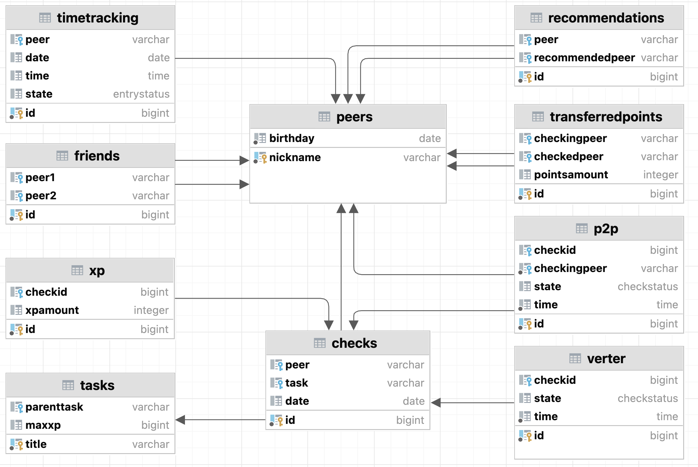

# School Info

В данном проекте реализована база данных обучающей школы, в которой представлена информация, анализ и статистика информации о студентах, заданиях, проверках и внутришкольной валюте.

В part1 описано создание таблиц и скриптов по импорту и экспорту данных из csv-файлов.

В part2 и part3 - процедуры, триггеры, функции по добавлению и поиску необходимой информации.

